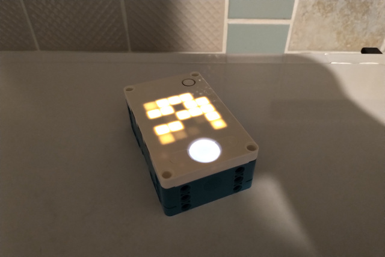

# robot-life



Conway's Game of Life on LEGO® MINDSTORMS® Robot Inventor.

_**Disclaimer:** LEGO® and MINDSTORMS® is a trademark of the LEGO Group of companies which does not sponsor, authorize or endorse this project._

⚠️ _**Warning:** if the program freezes, restart the LEGO® MINDSTORMS® intelligent Hub by long-pressing its center button._

## Features

- simulating of a toroidal field;
- use of the random filling as the initial population;
- restarting of the game after repeating of the same population;
- use of several brightness levels for displaying previous populations.

## Testing

To run the unit tests, use the following command:

```
$ make test
```

## Building

For the convenience of uploading the script to the LEGO® MINDSTORMS® intelligent Hub, it is worth combining all parts of the project together.

To do this, use the following command:

```
$ make build
```

The resulting file will be available at path `builds/robot_life.py`.

## Deploying

To deploy the building result, follow the steps below:

1. Create a new Python project in the LEGO® MINDSTORMS® Robot Inventor app.
2. Remove the whole default code.
3. Copy and paste the code from the building result (see file `builds/robot_life.py`).

## Usage of the Console Version

```
$ python3 -m robot_life -h | --help
$ python3 -m robot_life [options]
```

Options:

- `-h`, `--help` &mdash; show this help message and exit;
- `-W WIDTH`, `--width WIDTH` &mdash; field width (default: `80`);
- `-H HEIGHT`, `--height HEIGHT` &mdash; field height (default: `24`);
- `-P PERIOD`, `--period PERIOD` &mdash; population period (default: `0.1`);
- `-C CAPACITY`, `--capacity CAPACITY` &mdash; maximal history capacity (default: `1000000`);
- `-V VARIANTS`, `--variants VARIANTS` &mdash; character variants (default: `.:*#O`).

## Output Example for the Console Version

```
...#O*.O...:O##:#:....OO##.............OO...O*O**:#.......#.O..OO**OO..:....OOOO
####O***#...O.O.:*....*O.O...................O#.*OOO......###O..OOOOO...OO...#OO
#.#O.****:::O*::#.....OOO.....................O:**#.....OO##:#O..OO:.O..OO*.:**#
O.O:O.**.#OOO..*....OO.#........*..............#**.....#OOOOO#O..O###O..OO.....O
*.OOOO.:*.OOO.......O**........*::*.............***...*:*O:::.OO..O##O........::
O.##:#O:............OO#.......##:::..............**..*.OO.#..**.#......:......::
###:##O............O.O....O...**.::.........:O.O#*.#.:.OO*OO.#***O............*O
.#:OO.....::.......OO....#O#.....:.:*.......O*O.O**O::*..OO..OO***O............O
#OO*O#O....*...:..........O.....O::.OO......#OOO.O*.#O........#OO##O.OO.........
.OO**O#*....:..................#O#:.O#O.......OO:#O###O......O##.##..OOO.*O.....
.O*OO::#O....................#..OO*OO*O........#*O..#:O......O#:##:.O:OOOO.O.*..
..OOOOO##.:.....OO...........****OO:#:O*........O#:.OO*........##.##OO.#O#.#O*..
....OOO#:......O::O........:#**.O##*O*O.#*....OO*..O............###:OO****O.O#..
.......OO*.....*OOO..........#.#OOO.#.#*::...OO.OOOOOOOOO.*#....#.O.OO*.*O#.OOO.
.....:..##O.....:O.....:*.......*:.....*#*..O**#::....*OO.OOO..OOO...#.OO.OOO#:.
.....*#.###O.....:.:.:OO:*.......::.........#*O##.#O#..*O#OO.#.**O....O###.OO...
......#*O#O.....*:OO#O*O::......*OO*...........##.#*OO****.####.#.....:##.O#:...
...:...:O..:.....OOOOOOO.:*......OO..........:##.O..##*.**OO:###O.....O.OO*.*...
.:..:.#O#........OOO.O.O::...................O##O......#O.::::#.O....OO.OO*:*...
.*....O*OO#...........OO:.OO...........OO....O..O.....:O.#OO#OO.OO...OOO*#.#:...
##:....OO*OO..........OO**OOO.........O**O..OO*O:O*..*:OOO*O***OO:........OO:O*.
*:.OO..OOO#...........#***.OO.:.......O.OO..OO*OOO*...OO**.***..O........:.O###.
O###*O....:............****OO.:......OO*OO...OO.OO....OOO*O.:....#........O#####
O.##**O......OOO:*.....O**O#.........OO.OO..OO***.*......OOO....O*O#.......O.#..
```

## License

The MIT License (MIT)

Copyright &copy; 2021 thewizardplusplus
